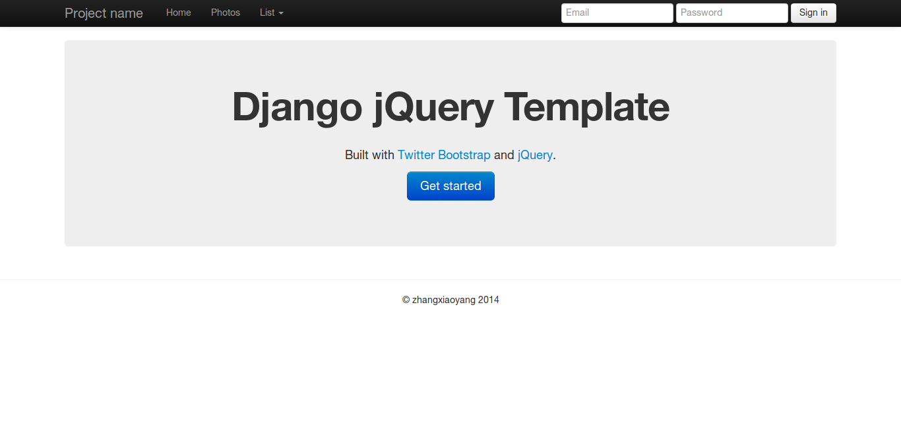
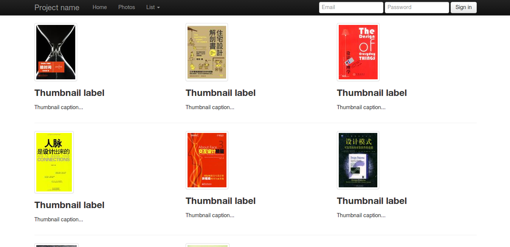

Django jQuery Template
======================

Demo HTML5 application built with Django, jQuery and Twitter Bootstrap2.

Copyright(C) 2014 zhangxiaoyang

License: [GNU GPL version 3 or later](LICENSE)

Screenshot
----------

Setup
-----

1. `sudo apt-get install python-virtualenv`
2. `sudo apt-get install python-pip`
3. `./setup.sh`

Run server
----------

1. `$ source env/bin/activate && cd ui`
2. `$ python manage.py runserver`

Have fun
--------

<http://127.0.0.1:8000>
